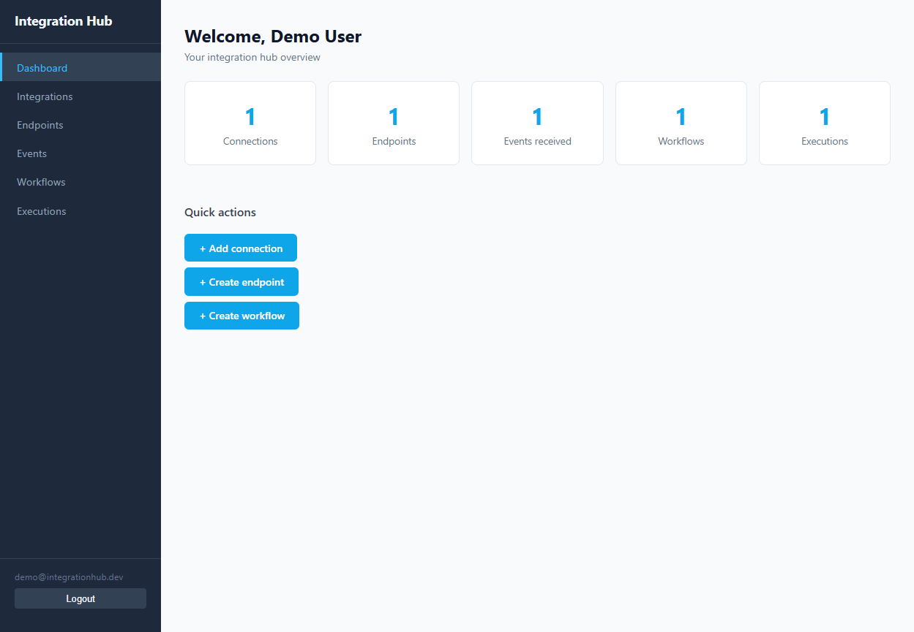
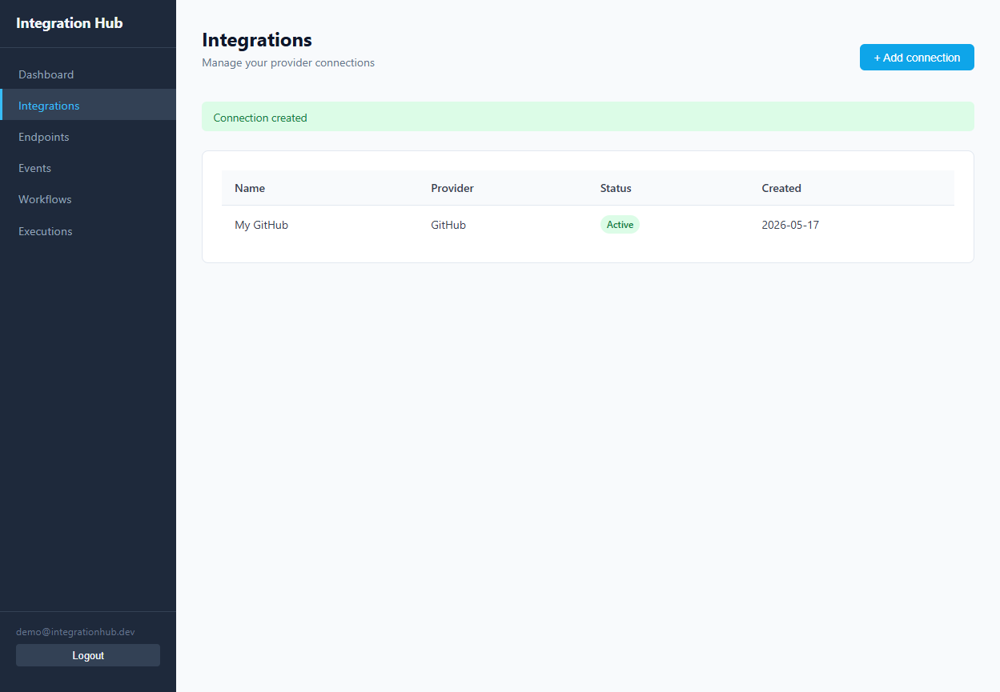
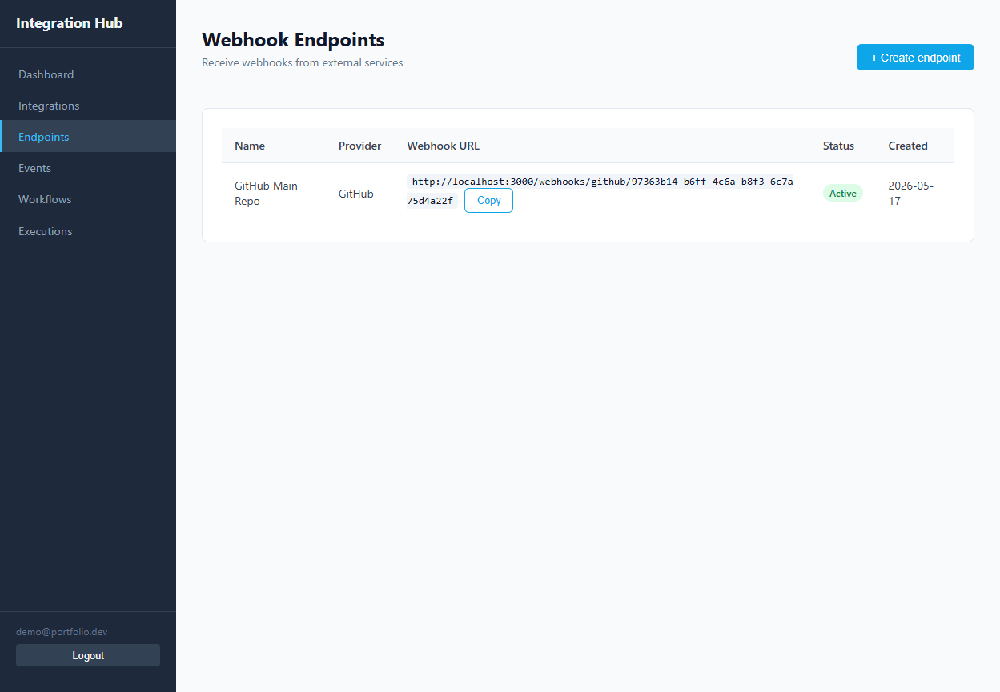
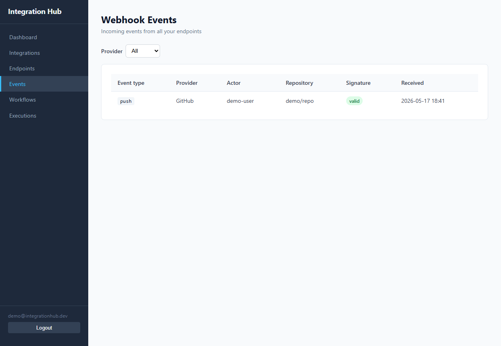
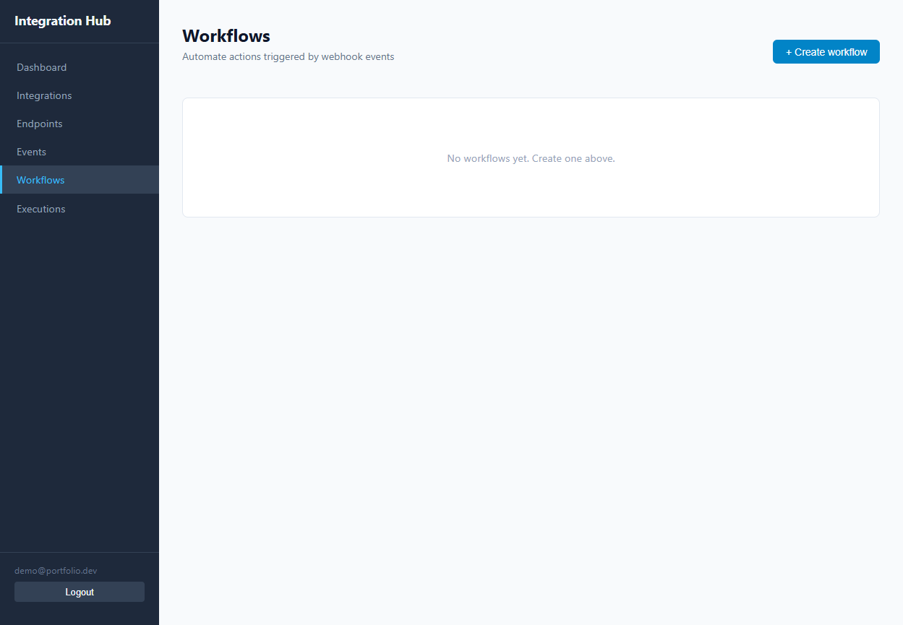
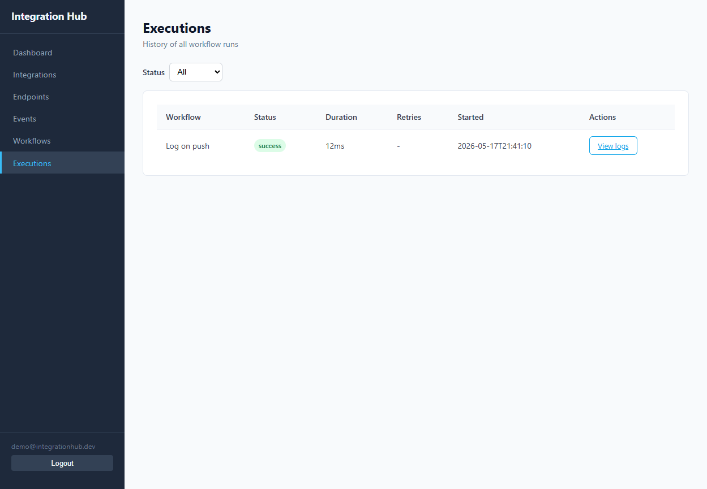
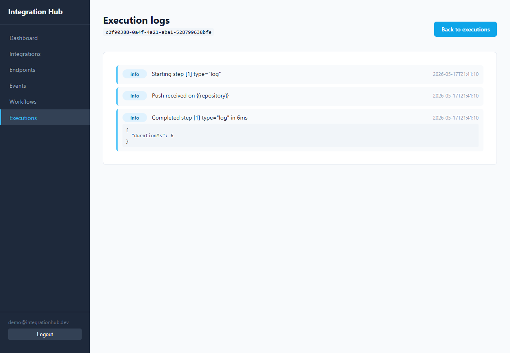

# Integration Hub

[](https://github.com/alecsmatos1/Integration-Hub/actions/workflows/ci.yml)

A webhook-to-workflow automation platform. Connect your GitHub account, receive webhook events, and trigger automated workflows - with a full-stack web UI and a REST API.

Built as a portfolio project demonstrating NestJS, Angular, Prisma, JWT auth, HMAC signature verification, and GitHub Actions CI.

---

## What This Demonstrates

| Skill | Implementation |
|---|---|
| Backend architecture | NestJS modular design with controllers, services, guards, and decorators |
| Authentication | JWT access + refresh tokens, bcrypt hashing, Passport strategy |
| Webhook security | HMAC-SHA256 signature verification using raw request body |
| Data persistence | Prisma ORM with PostgreSQL, migrations, relational queries |
| Async execution | In-memory queue with `setImmediate`, isolated WorkflowRunner; `log` and `http_request` step types |
| Multi-user isolation | All queries scoped by `userId`; cross-user access returns 404 |
| API security | CORS, rate limiting via `@nestjs/throttler`, secret stripping from responses |
| Frontend | Angular 21 standalone components, signals, lazy routes, HTTP interceptors |
| Testing | Jest e2e (43 tests), unit tests (23), Vitest frontend (8) |
| CI/CD | GitHub Actions with PostgreSQL service container |

---

## Portfolio Highlights

- Full-stack SaaS-style architecture with NestJS and Angular.
- Real GitHub webhook ingestion with HMAC-SHA256 signature verification.
- Workflow execution pipeline with persisted per-step execution logs.
- Multi-user isolation — all resources scoped by authenticated user.
- JWT access + refresh token auth with Passport strategy.
- CI pipeline with PostgreSQL service container and automated tests.

> The current MVP focuses on GitHub webhooks. The workflow engine is intentionally linear — steps run in sequence with full log output. Other providers (Slack, Discord) are planned but not yet implemented.

---

## Architecture

```
apps/
  backend/    NestJS 11 REST API (auth, integrations, webhooks, workflows, executions)
  frontend/   Angular 21 SPA (dashboard, integrations, endpoints, events, workflows, executions)
packages/
  integrations/ Provider SDK contracts
```

```
GitHub Webhook -> POST /webhooks/github/:pathToken
                       |
                   HMAC-SHA256 verify (x-hub-signature-256)
                       |
                  Save WebhookEvent
                       |
              triggerForEvent (filtered by endpoint owner userId)
                       |
             Enqueue WorkflowExecution (setImmediate)
                       |
              WorkflowRunner executes steps in order
                       |
                ExecutionLog entries persisted per step
```

## Stack

| Layer | Technology |
|---|---|
| Backend | NestJS 11, Express, Passport-JWT |
| ORM | Prisma 7 + `@prisma/adapter-pg` |
| Database | PostgreSQL 16 |
| Frontend | Angular 21 (standalone components, signals, lazy routes) |
| Testing | Jest 30 (backend), Vitest 4 (frontend) |
| CI | GitHub Actions |

---

## Live Demo

> Public deployment is in progress (Railway + Vercel). Until then, follow the Quick Start below to run it locally in under 5 minutes.

---

## Quick Start

### Prerequisites

- Node.js 22+
- Docker Desktop (for PostgreSQL via Docker Compose)

### 1. Database

```bash
docker compose -f infrastructure/docker/docker-compose.yml up -d
```

### 2. Backend

```bash
cd apps/backend
cp .env.example .env          # set JWT_SECRET and JWT_REFRESH_SECRET
npm install
npx prisma migrate deploy
npm run start:dev             # http://localhost:3000
# Swagger UI: http://localhost:3000/api
```

### 3. Frontend

```bash
cd apps/frontend
npm install
npm start                     # http://localhost:4200
```

---

## Demo Flow

1. Register at `http://localhost:4200/register`
2. Go to **Integrations** → Add a GitHub connection (name it anything; set secret to `demo-secret`)
3. Go to **Endpoints** → Create an endpoint → copy the webhook URL (contains a `pathToken`)
4. Go to **Workflows** → Create a workflow with trigger `github / push` and a `log` step
5. Send a simulated signed webhook (PowerShell):

```powershell
$payload='{"ref":"refs/heads/main","repository":{"full_name":"demo/repo"},"sender":{"login":"demo-user"}}'
$secret='demo-secret'
$hmac=[System.Security.Cryptography.HMACSHA256]::new([Text.Encoding]::UTF8.GetBytes($secret))
$hash=($hmac.ComputeHash([Text.Encoding]::UTF8.GetBytes($payload))|ForEach-Object{$_.ToString("x2")})-join''
$sig="sha256=$hash"
$body=[System.Text.Encoding]::UTF8.GetBytes($payload)
$req=[System.Net.HttpWebRequest]::Create("http://localhost:3000/webhooks/github/<pathToken>")
$req.Method="POST"; $req.ContentType="application/json"
$req.Headers.Add("X-GitHub-Event","push")
$req.Headers.Add("X-Hub-Signature-256",$sig)
$req.ContentLength=$body.Length
$s=$req.GetRequestStream(); $s.Write($body,0,$body.Length); $s.Close()
$req.GetResponse().GetResponseStream()|%{(New-Object System.IO.StreamReader($_)).ReadToEnd()}
```

6. Go to **Events** → confirm the push event was received with `signatureValid: true`
7. Go to **Executions** → confirm `success` status
8. Click **View logs** → see per-step output

---

## API Examples

```bash
# Register
curl -X POST http://localhost:3000/auth/register \
  -H 'Content-Type: application/json' \
  -d '{"email":"me@example.com","password":"Test1234!","name":"Demo"}'

# Login
TOKEN=$(curl -s -X POST http://localhost:3000/auth/login \
  -H 'Content-Type: application/json' \
  -d '{"email":"me@example.com","password":"Test1234!"}' | jq -r .accessToken)

# Create connection
curl -X POST http://localhost:3000/integrations/connections \
  -H "Authorization: Bearer $TOKEN" \
  -H 'Content-Type: application/json' \
  -d '{"provider":"github","name":"My GitHub","secret":"my-hmac-secret"}'

# Create webhook endpoint
curl -X POST http://localhost:3000/webhooks/endpoints \
  -H "Authorization: Bearer $TOKEN" \
  -H 'Content-Type: application/json' \
  -d '{"name":"Prod Hook","connectionId":"<connection-id>"}'

# Simulate a signed GitHub push
PAYLOAD='{"ref":"refs/heads/main"}'
SIG="sha256=$(echo -n "$PAYLOAD" | openssl dgst -sha256 -hmac "my-hmac-secret" | awk '{print $2}')"
curl -X POST http://localhost:3000/webhooks/github/<pathToken> \
  -H 'Content-Type: application/json' \
  -H "X-GitHub-Event: push" \
  -H "X-Hub-Signature-256: $SIG" \
  -d "$PAYLOAD"

# Filter executions by status
curl -H "Authorization: Bearer $TOKEN" \
  "http://localhost:3000/executions?status=success"

# Filter events by type
curl -H "Authorization: Bearer $TOKEN" \
  "http://localhost:3000/webhooks/events?provider=github&eventType=push"

# Retry a failed execution
curl -X POST -H "Authorization: Bearer $TOKEN" \
  "http://localhost:3000/executions/<execution-id>/retry"
```

---

## Screenshots

**Dashboard** — overview with live counts of connections, endpoints, events, and executions.



**Integrations** — manage GitHub connections with optional HMAC webhook secrets.



**Webhook Endpoints** — copyable webhook URLs per provider connection.



**Webhook Events** — incoming event log with HMAC signature validation status.



**Workflows** — trigger configuration (provider + event type) and step definitions.



**Executions** — execution history with status badges, duration, and retry count.



**Execution Logs** — per-step log output for every workflow run.



---

## Running Tests

```bash
# Backend unit tests
cd apps/backend && npm test -- --runInBand

# Backend e2e tests (requires PostgreSQL)
cd apps/backend && npm run test:e2e

# Frontend tests
cd apps/frontend && npm test -- --watch=false
```

---

## Roadmap

**Done**
- JWT auth with access + refresh tokens
- GitHub webhook receiver with HMAC verification
- Webhook event history with filtering
- Linear workflow execution engine with `log` and `http_request` step types
- HTTP request step: real `fetch` with AbortController timeout, status logging, response preview
- Execution logs per step
- Angular dashboard with signals and lazy routes
- CI pipeline with PostgreSQL service container

**Next**
- Public deployment (Railway + Vercel)
- Frontend API URL driven by environment variable

**Later**
- Slack / Discord providers
- BullMQ + Redis queue for execution
- Workflow editor UI
- Encrypted secrets at rest

---

## Documentation

- [Architecture](docs/ARCHITECTURE.md)
- [Deployment guide](docs/DEPLOYMENT.md)
- [Roadmap](docs/ROADMAP.md)
